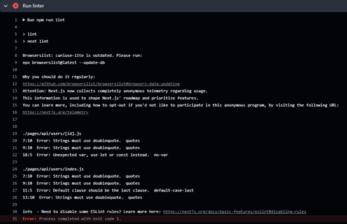
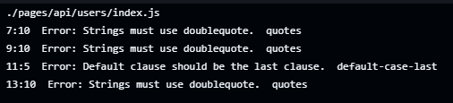
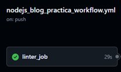
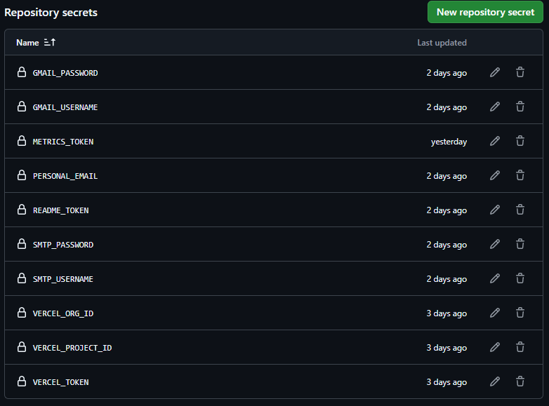
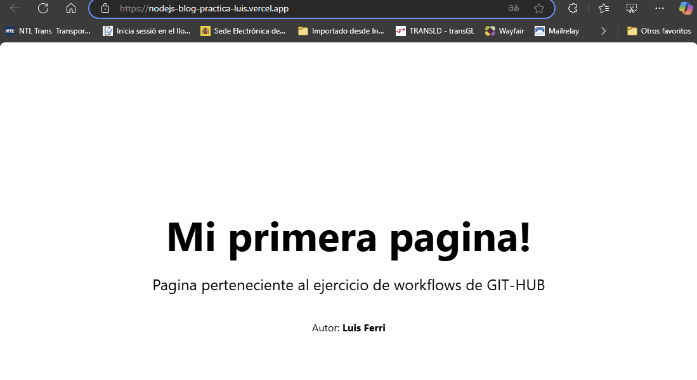
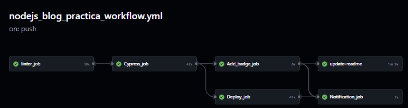

Example of nextjs project using Cypress.io

<!---Start place for the badge-->


<!---End place for the badge-->


# Práctica - GitHub Actions

## Introducción
En esta práctica, se utilizan varias herramientas y conceptos importantes en el desarrollo y despliegue de aplicaciones web.  
A continuación, presento una breve introducción a cada uno de estos conceptos que trataremos en esta práctica:

### GitHub Actions
GitHub Actions es una plataforma de integración continua y entrega continua (CI/CD) que permite automatizar flujos de trabajo directamente desde el repositorio de GitHub. Con GitHub Actions, se pueden definir *workflows* que se ejecutan en respuesta a eventos específicos, como *commits* y *pull requests*.  

### Linter
Un **linter** es una herramienta que analiza el código fuente para identificar errores de programación, *bugs* y problemas de estilo. En esta práctica, utilizaremos un linter para asegurar la calidad y fiabilidad del código.  

### Cypress
**Cypress** es una herramienta de pruebas *end-to-end* (E2E) para aplicaciones web. Permite escribir y ejecutar pruebas que simulan la interacción del usuario con la aplicación, verificando que todo funcione como se espera.  

### Vercel
**Vercel** es una plataforma de despliegue para aplicaciones web estáticas. Permite desplegar aplicaciones de manera rápida y sencilla, proporcionando una infraestructura escalable y de alto rendimiento.  

### Badges
Los **badges** son insignias que se pueden agregar a los archivos `README.md` para mostrar el estado de las pruebas, la cobertura del código y otros indicadores de calidad del proyecto.  

### Artefactos
En el contexto de CI/CD, los artefactos son archivos generados durante la ejecución de un *workflow* que pueden ser almacenados y compartidos.  
En esta práctica, se utilizan artefactos para guardar los resultados de las pruebas de Cypress.  

### Métricas
Las métricas proporcionan información sobre el rendimiento y la calidad del código. En esta práctica, se generan métricas y se agregan al archivo `README.md` del perfil principal para proporcionar una visión general del proyecto.  


## Documentación del Workflow de GitHub Actions

Una vez descargado el proyecto, crearemos un fichero nodejv_blog_practica_workflow.yml dentro de github/workflows que sera donde  
almacenaremos todos los jobs que contendra esta practica.


### Nombre del Workflow
```yaml
name: nodejs_blog_practica
```

### Eventos Disparadores del Workflow
```yaml
on:
  push:
    branches:
      - main
```
Este workflow se ejecuta automáticamente cuando hay un push en la rama main.  

### Jobs que componen el workflow.

## Linter_job

```yaml
jobs:
  linter_job:
    runs-on: ubuntu-24.04
    steps:
      - name: Checkout code
        uses: actions/checkout@v3

      - name: Setup Node.js
        uses: actions/setup-node@v3
        with:
          node-version: "16"

      - name: Clean npm cache
        run: npm cache clean --force

      - name: Set npm registry
        run: npm set registry https://registry.npmjs.org/

      - name: Install dependencies
        run: npm install

      - name: Run linter
        run: npm run lint
```
### steps que componen el linter job:

Checkout code: Descarga el código del repositorio en el sistema de archivos de la maquina virtual con la accion actions/checkout@v3  
Setup Node.js: Configura un entorno Node.js en su versión 16.   
Clean npm cache: Limpia la caché de npm.  
Set npm registry: Configura el registro de npm.  
Install dependencies: Instala las dependencias del proyecto.  
Run linter: Ejecuta el linter para verificar el código.  

Este paso, inicialmente ya nos devuelve errores de codigo, los cuales corregiremos posteriormente.  



Nos indica que hay errores en el fichero “./pages/api/users/[id].js”, en concreto el uso de comillas simples y el uso de “var” en la declaración de la variable.

Lo arreglamos y volvemos a ejecutar un push origin main.  



Vuelve a dar un error, esta vez son comillas simples en el fichero index.js y el orden del default en el switch case.  
Lo arreglamos y volvemos a ejecutar un push origin main.  



Ahora ya devuelve un resultado correcto.


## Cypress_job

```yaml
Cypress_job:
    needs: linter_job
    runs-on: ubuntu-24.04
    steps:
      - name: Checkout code
        uses: actions/checkout@v4

      - name: Install dependencies
        run: npm install

    - name: Run Cypress tests
      uses: cypress-io/github-action@v6
      with:
        start: npm run start
        wait-on: "http://localhost:3000"
        wait-on-timeout: 60
        record: true
        output-folder: cypress/results
      continue-on-error: true

      - name: Save Cypress test results
        run: |
          if [ $? -eq 0 ]; then echo "success" > result.txt
          else
          echo "failure" > result.txt
          ls -l
          cp cypress/videos/*.mp4 . || true
          cat result.txt
        shell: bash

      - name: Upload artifact
        uses: actions/upload-artifact@v4
        with:
          name: cypress-results
          path: result.txt
```
Checkout code: Descarga el código del repositorio.  
Install dependencies: Instala las dependencias del proyecto.  
Run Cypress tests: Ejecuta las pruebas de Cypress.  
En este paso tambien indicamos que continue aunque exista algún error.  
Save Cypress test results: Guarda los resultados de las pruebas de Cypress en un archivo result.txt.  
Upload artifact: Sube el archivo result.txt como un artefacto.  


## Add_badge_job

```yaml
Add_badge_job:
    needs: Cypress_job
    runs-on: ubuntu-24.04
    steps:
      - name: Checkout code
        uses: actions/checkout@v3

      - name: Retrieve Cypress results
        uses: actions/download-artifact@v4
        with:
          name: cypress-results
          path: . # Descargar en el directorio raíz

      - name: generate_output
        id: generate_output
        run: |
          echo "cypress_outcome=$(cat result.txt)" >> $GITHUB_ENV

      - name: Add badge to README
        uses: ./ #action.yml
        with:
          outcome: ${{ steps.generate_output.outputs.cypress_outcome }}

      - name: Hace un commit de los cambios del README
        uses: EndBug/add-and-commit@v9.1.3
        with:
          add: README.md
          author_name: luisff73
          author_email: jvrluis@hotmail.com
          message: "Actualizando el resultado del test badge"
          push: true
          github_token: ${{ secrets.README_TOKEN }}
```
Checkout code: Descarga el código del repositorio.  
Retrieve Cypress results: Descarga los resultados de las pruebas de Cypress.  
generate_output: Genera una variable de entorno cypress_outcome con el resultado de las pruebas.  
Add badge to README: Agrega un badge al archivo README.md basado en el resultado de las pruebas.  
Hace un commit de los cambios del README: Hace un commit de los cambios en el archivo README.md y los sube al repositorio.  

## Deploy_job:

```yaml
Deploy_job:
    runs-on: ubuntu-24.04
    needs: Cypress_job # Depende del Cypress_job
    steps:
      - name: Checkout code
        uses: actions/checkout@v2

      - name: Deploy to Vercel
        uses: amondnet/vercel-action@v25
        with:
          vercel-token: ${{ secrets.VERCEL_TOKEN }} # Configura el token a secrets
          vercel-args: "--prod"
          working-directory: ./
          vercel-org-id: ${{ secrets.VERCEL_ORG_ID }} # Configura el ID de la organización a secrets
          vercel-project-id: ${{ secrets.VERCEL_PROJECT_ID }} # Configura el ID del proyecto a secrets
```
Checkout code: Descarga el código del repositorio.  
Deploy to Vercel: Despliega la aplicación a Vercel usando el token y los IDs de organización y proyecto configurados en los secretos.  
Previamente, en github, en settings, en el apartado de secrets and variables  
crearemos las secrets con los tokens necesarios de vercel para poder desplegar  
correctamente nuestra aplicación en vercel.  


Observamos que ya esta disponible en vercel.  


## Notificacion_job:

```yaml
Notification_job:
    runs-on: ubuntu-24.04
    needs: [linter_job, Cypress_job, Add_badge_job, Deploy_job] # Depende de todos los trabajos anteriores
    if: always()
    steps:
      - name: Send notification email
        uses: dawidd6/action-send-mail@v3
        with:
          server_address: smtp.gmail.com
          server_port: 587
          username: ${{ secrets.GMAIL_USERNAME }}
          password: ${{ secrets.GMAIL_PASSWORD }}
          subject: "Resultat del workflow executat"
          to: ${{ secrets.PERSONAL_EMAIL }}
          from: "GitHub Actions <actions@example.com>"
          body: |
            S'ha realitzat un push en la branca main que ha provocat l'execució del workflow nodejs_blog_practica amb els següents resultats:

            - linter_job: ${{ needs.linter_job.result }}
            - cypress_job: ${{ needs.Cypress_job.result }}
            - add_badge_job: ${{ needs.Add_badge_job.result }}
            - deploy_job: ${{ needs.Deploy_job.result }}
```
Send notification email: Envía un correo electrónico con los resultados del workflow a una dirección de correo configurada en los secretos.  
He añadido el needs [linter_job, Cypress_job, Add_badge_job, Deploy_job] para que dependa de la 
ejecucion de estos jobs, y así poder recoger el resultado de su ejecución.
Configuramos los datos del correo.  

En el caso de gmail, he tenido que crear un token para dar permiso a github para que envie correos.  

Por supuesto, tambien hay que crear las secrets con el USERNAME, PASSWORD y PERSONAL_EMAIL  
Para recoger el estado final de cada job utilizaremos las variables de contexto de github 
{needs.nombre del job.result}.  


## update-readme:

```yaml
update-readme:
    needs: Add_badge_job
    runs-on: ubuntu-24.04
    steps:
      - name: Checkout repository
        uses: actions/checkout@v3

      - name: Generate metrics
        uses: lowlighter/metrics@latest
        with:
          token: ${{ secrets.METRICS_TOKEN }}
          user: luisff73 # Reemplaza con tu nombre de usuario de GitHub
          template: classic
          base: header, activity
          config_timezone: Europe/Madrid
          plugin_languages: yes
          plugin_languages_sections: most-used
          plugin_languages_indepth: yes
          plugin_languages_recent_load: 20
          plugin_languages_recent_days: 14
```

Checkout repository: Descarga el código del repositorio.  
Generate metrics: Genera un fichero con la extension svg, con las métricas para agregarlas  posteriormente a nuestro perfil de GITHUB con un link a dicho fichero de estadisticas generado.  

La action lowlighter/metrics@latest dispone de multitud de tests que podemos añadir, yo en este  
caso he añadido las mas habituales.  

Finalmente podemos ver que cuando hacemos un push se ejecutan todos los jobs satisfactoriamente.  



## Resumen
# Este workflow de GitHub Actions realiza las siguientes tareas:

Ejecuta un linter para verificar el código.  
Ejecuta pruebas de Cypress y guarda los resultados.  
Agrega un badge al archivo README.md basado en los resultados de las pruebas.  
Despliega la aplicación a Vercel.  
Envía una notificación por correo electrónico con los resultados del workflow.  
Genera métricas y actualiza el archivo README.md del perfil del usuario.  
